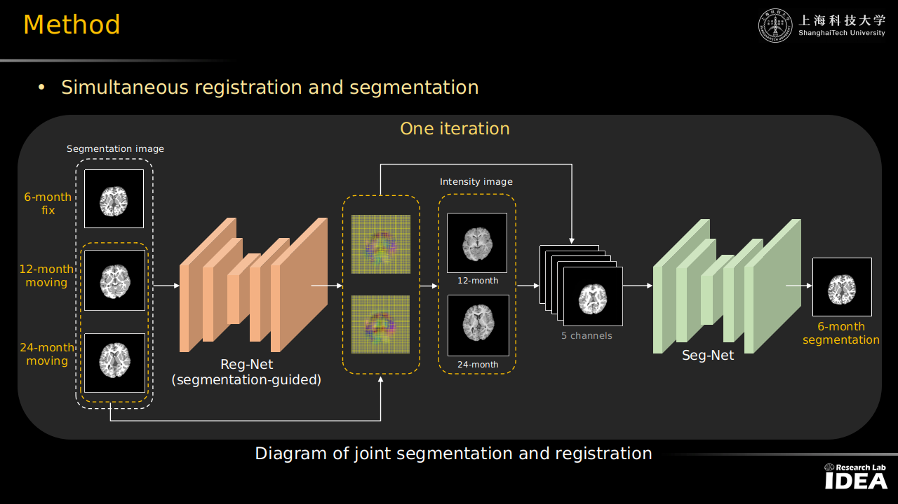
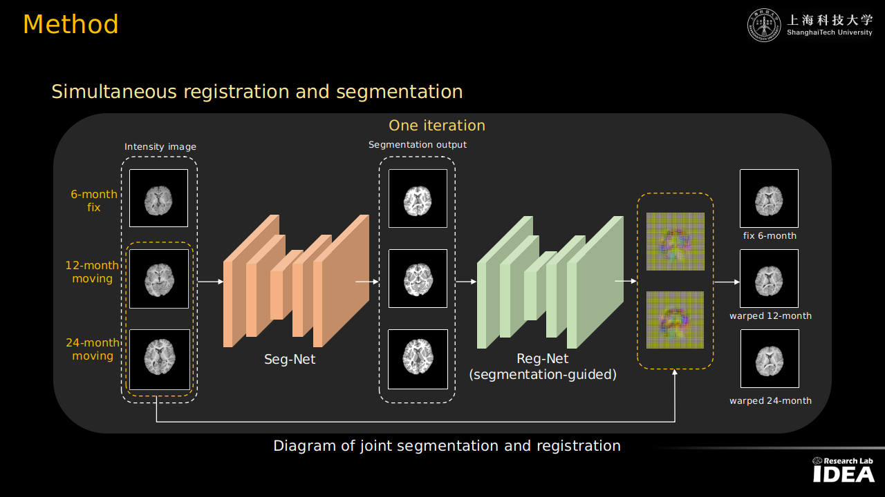
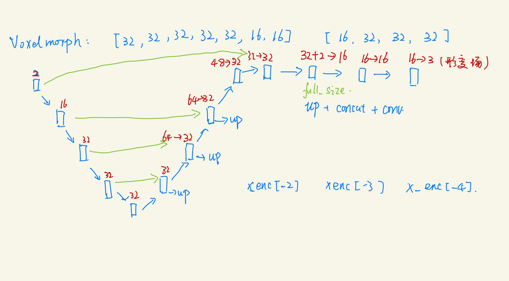

## infant brain segmentation and registration
* First update time: 2022.07.05

**This code implement the simultaneous registration and segmentation
of infant brain T1 image by the following pipeline.**

Different month images segmentation are inputed to the registration network,
obtain the deformation field of segmentation images. Then apply the DVFs to
the corresponding original intensity image, resulting in 4 images, along with
original 06 mo intensity images, we have 5 images as input (5-channels) to the
following segmentation network.

* Second update time: 2022.08.30

Different month original images are inputed to the segmentation network,
obtain the segmentation maps (multi-channel segmentation results). Then put
the obtained segmentation maps to the registration network (segmentation map
registration), (12 mo and 24 mo align to 06 mo), resulting in 2 DVFs (12 mo
and 24 mo). Then DVFs to the intensity images, we obtain the aligned 3 month
(06, 12, 24 mo) images.

